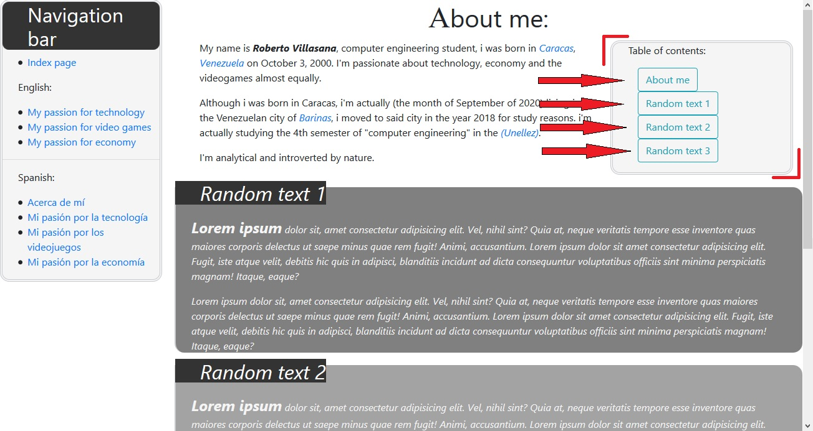
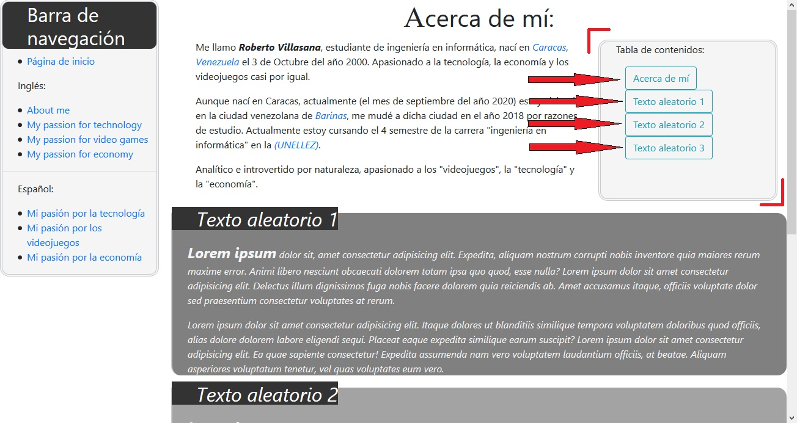
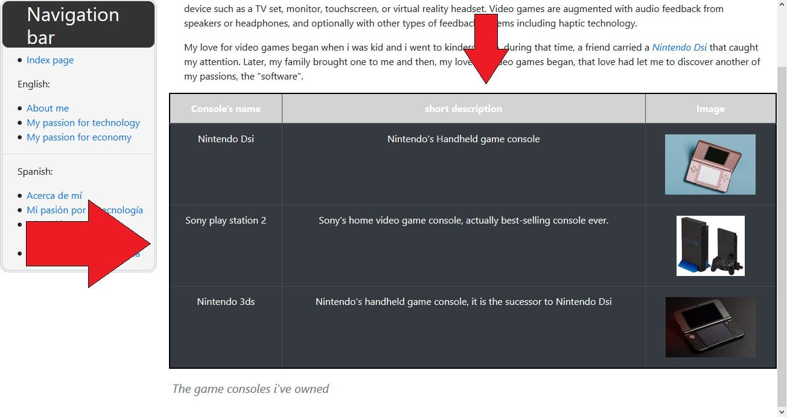
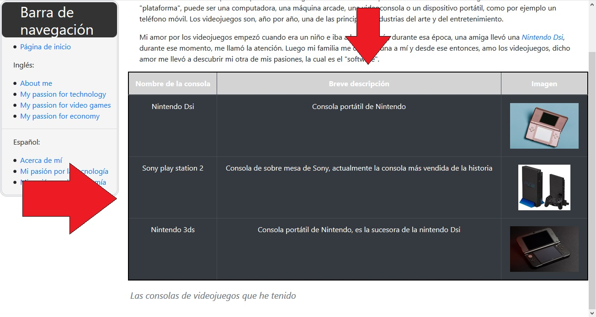
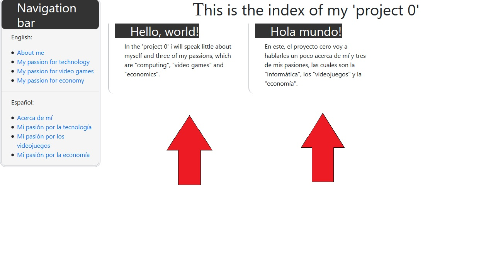

# Project 0 description

In the "project 0" i developed a web site with 9 web pages (HTML documents) "index.html" included. After "index.html" we have 2 sections with 4 pages each one, where i talk a little about me and some of my passions, however, in one section the content is written in English, and in the second section, we have the same content but written in spanish.

Inside of the web pages we can find:

### 1. Index page / Página de inicio (index.html)

We can see a simple page is that has a title and two paragraphs arranged horizontally by the Bootstrap's grid (if the screen where the page is displayed has been considered a large screen by Bootstrap).

We also have a navigation bar that is repeated on all pages and that allows us to move to other HTML documents in the project.

## English

### 2. About me (/en/about.html)

This is a page written in English where I talk a bit about myself, apart from that we have three sections with paragraphs of random text and we also have a "table of contents" where we have some buttons that if we click on any of those we are redirected to any of each section with random text.

### 3. My passion for technology (/en/tech.html)

This page is written in English and in it I talk a bit about my passion for technology, computing and programming.

### 4. My passion for video games (/en/games.html)

This is a page written in English where I tell you about my passion for video games and I have a table with the main game consoles that I have throughout my life.

### 5. My passion for economy (/en/economy.html)

This page is written in English and in it I talk a bit about my passion for economics and i define economics according to Wikipedia.

__________

## Español

### 6. Acerca de mí (/es/about.html)

A page written in Spanish, just like "about.html in English", here I talk a bit about myself and I have three sections with paragraphs of random text, besides that, we have a "tabla de contenidos" (table of contents) where we can see some buttons and if we click in any of them we are redirected to any of each section.

### 7. Mi pasión por la tecnología (/es/tech.html)

Here we have another page written in Spanish where I explain about my passion for technology, computing and programming.

### 8. Mi pasión por los videojuegos (/es/games.html)

This is a page written in Spanish where I tell you about my passion for video games and I have a table with the main game consoles that I have had troughout my life.

### 9. Mi pasión por la economía (/es/economy.html)

The last page, which is written in Spanish and where I tell you about my passion for economics and put a brief definition taken from Wikipedia.

__________________________________________

This website has three main style sheets:

1. "/style.css"

This is the **basic style sheet**.

2. "/Bootstrap4/bootstrap.min.css"

This is the **Bootstrap 4** stylesheet, wich was downloaded and added to the project.

3. "/Sass/style2.css"

This is the compiled stylesheet from **Sass**.

_________________

## Media Queries:

The project has two **media queries**, which are in **the basic stylesheet**. The first media query is for screens that are 880 pixels wide (or more), it will make our page more comfortable to large screens. While the other media query is activated on screens with a width of 879 pixels (or less), it will make our page smaller, with a basic responsive design.

_______________

## Bootstrap 4:

### *Buttons*:

A Bootstrap component that was used in the project were the buttons, which were utilized in the "table of contents" buttons in "About me" (/en/about.html):

I also have Bootstrap buttons in the "tabla de contenidos" in "Acerca de mí" (/es/about.html):

### *Stylized of tables*:

In the project I took advantage of the way to style the Bootstrap tables, precisely the "table-dark" style, that style was used in two tables, the first in "My passion for video games" (/en/games.html):

We also used the same style in "Mi pasión por lo videojuegos" (/es/games.html):

### *Bootstrap grid system*:

We used the Bootsrap grid system in the "Index page / Página de inicio" (/index.html):

__________________________________________

Web Programming with Python and JavaScript
